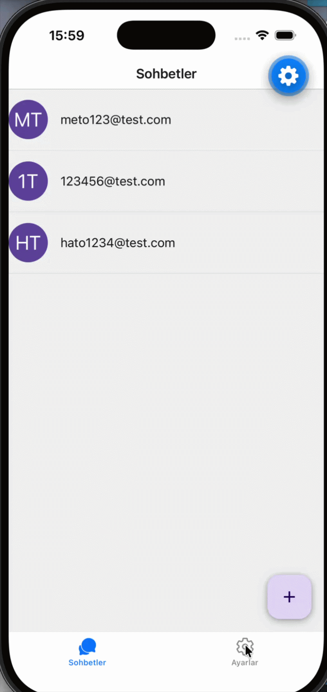

# 💬 ChatApp

Gerçek zamanlı mesajlaşma uygulaması. React Native + Expo ile geliştirilmiş, Firebase altyapısı kullanan cross-platform bir mobil uygulamadır.

---

## 📸 Ekran Görüntüleri





---

## 🚀 Özellikler

- 💬 Gerçek zamanlı sohbet
- 👤 Kullanıcı avatarları (baş harflerden otomatik oluşturma)
- ➕ Yeni sohbet başlatma
- ⚙️ Ayarlar ekranı
- 📱 iOS ve Android desteği
- 🔐 Firebase Authentication ile güvenli giriş

---

## 🛠️ Kullanılan Teknolojiler

| Teknoloji | Versiyon |
|-----------|----------|
| React Native | 0.85.3 |
| Expo | ~56.0.12 |
| Firebase | ^12.15.0 |
| React Navigation | ^7.x |
| React Native Paper | ^5.15.3 |
| Async Storage | 2.2.0 |
| Expo Crypto | ~56.0.4 |

---

## 📁 Proje Yapısı

```
chatapp/
├── assets/
├── src/
│   ├── screens/
│   │   ├── ChatsScreen.js
│   │   ├── ChatDetailScreen.js
│   │   └── SettingsScreen.js
│   ├── components/
│   ├── navigation/
│   └── firebase/
│       └── config.js
├── App.js
└── package.json
```

---

## ⚙️ Kurulum

### Gereksinimler

- Node.js (v18+)
- Expo CLI
- Firebase projesi

### 1. Repoyu Klonla

```bash
git clone https://github.com/kullanici-adi/chatapp.git
cd chatapp
```

### 2. Bağımlılıkları Yükle

```bash
npm install
```

### 3. Firebase Yapılandırması

`src/firebase/config.js` dosyasını oluştur ve Firebase proje bilgilerini ekle:

```js
import { initializeApp } from "firebase/app";

const firebaseConfig = {
  apiKey: "YOUR_API_KEY",
  authDomain: "YOUR_AUTH_DOMAIN",
  projectId: "YOUR_PROJECT_ID",
  storageBucket: "YOUR_STORAGE_BUCKET",
  messagingSenderId: "YOUR_MESSAGING_SENDER_ID",
  appId: "YOUR_APP_ID"
};

export const app = initializeApp(firebaseConfig);
```

### 4. Uygulamayı Başlat

```bash
# Genel başlatma
npm start

# Android
npm run android

# iOS
npm run ios

# Web
npm run web
```

---


## 🔗 Firebase Kurulumu

1. [Firebase Console](https://console.firebase.google.com)'a gir
2. Yeni proje oluştur
3. **Authentication** → Email/Password yöntemini etkinleştir
4. **Firestore Database** oluştur
5. Proje ayarlarından `firebaseConfig` bilgilerini kopyala

---

## 🤝 Katkıda Bulunma

1. Bu repoyu fork edin
2. Yeni bir branch oluşturun (`git checkout -b feature/yeni-ozellik`)
3. Değişikliklerinizi commit edin (`git commit -m 'Yeni özellik eklendi'`)
4. Branch'i push edin (`git push origin feature/yeni-ozellik`)
5. Pull Request açın

---

## 📄 Lisans

Bu proje MIT lisansı altında lisanslanmıştır.

---

